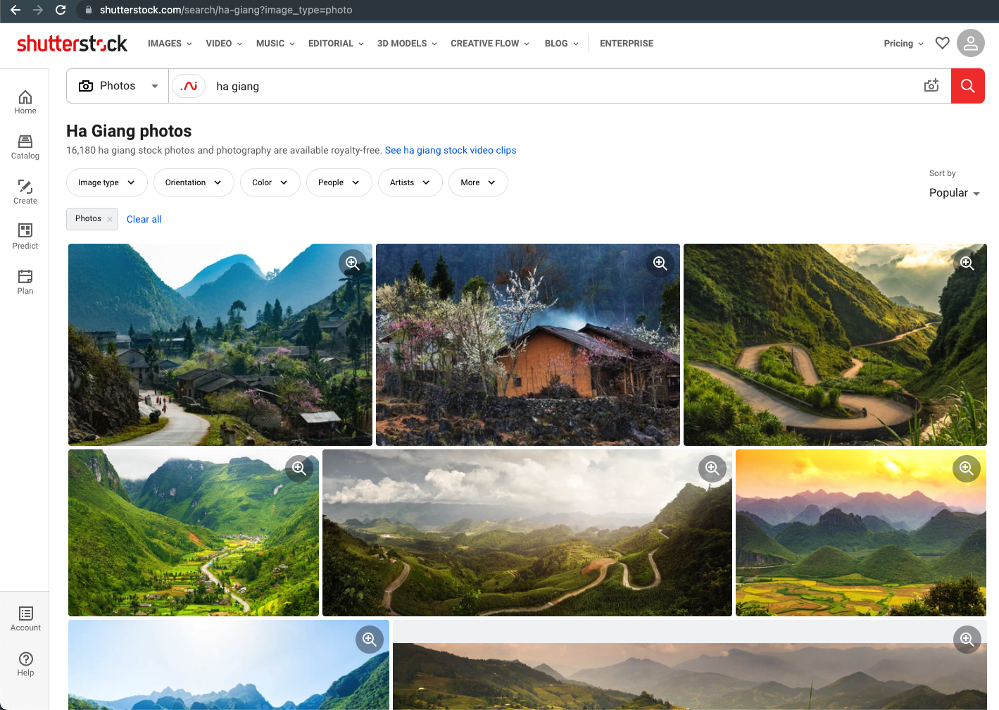
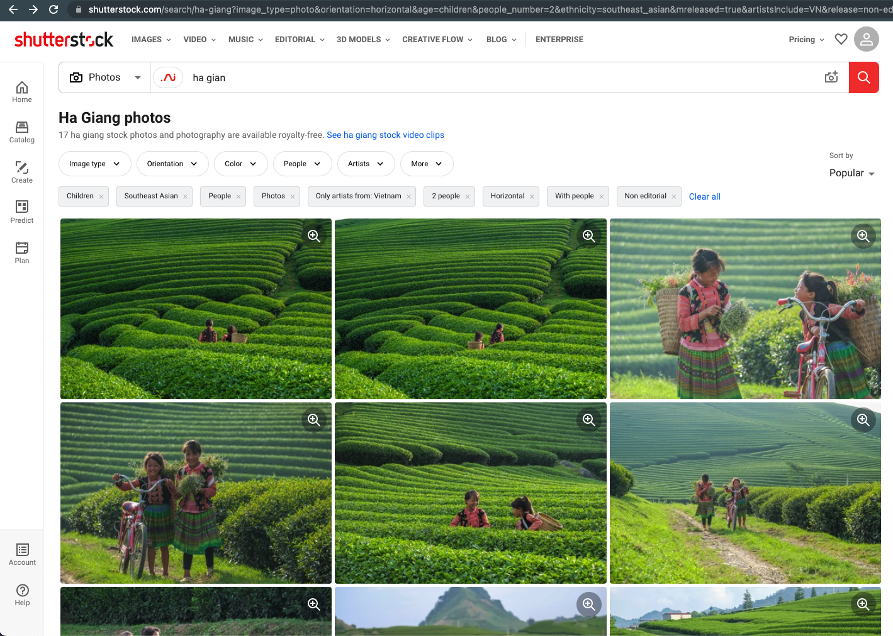

# shutterstock_analysis
Analyze Shutterstock insights for photo licensing

<div>
  
  
  
  
</div>

# II. REFERENCES
## 2.1. How to use this package?
- Install the stable version: `pip install shutterstock_analysis`
- You can install the latest `shutterstock_analysis` version from source with the following command:
`pip install git+https://github.com/thinh-vu/shutterstock_analysis.git@main`

_(*) You might need to insert a `!` before your command when running terminal commands on Google Colab._

- To start using functions, you need to import them: `from shutterstock_analysis import *`

## Function references
- Get multiple pages of search results:
  search_df = `search_results('ha giang', page_limit=10)`
- Get bulk photos details:
  bulk_photo_detail = `bulk_photo_detail(search_df, limit=100)`
- Export data:
  `search_df.to_csv('YOUR_PATH_TO_FILE.csv', index=False)`
  `bulk_photo_detail.to_csv('YOUR_PATH_TO_FILE.csv', index=False)`

# III. APENDICES
- Default photo search query: 
```https://www.shutterstock.com/_next/data/abgKsgPYfFDoIqIr0JlX0/en/_shutterstock/search/ha-giang.json?image_type=photo&term=ha-giang```

  <details>
  <summary>Default Search UI</summary>

    

  </details>

- Advanced photo search query: 
```https://www.shutterstock.com/_next/data/abgKsgPYfFDoIqIr0JlX0/en/_shutterstock/search/ha-giang.json?image_type=photo&term=ha-giang&page=2&&contributor=Big+Pearl&category=Nature&sort=newest&release=editorial&mreleased=true&exclude=car%2C+bike&artistsInclude=VN&authentic=true```

  <details>
    <summary>Advanced Search UI</summary>

    
      
  </details>

# IV. 🙋‍♂️ CONTACT INFORMATION
You can contact me at one of my social network profiles:

<div id="badges" align="center">
  <a href="https://www.linkedin.com/in/thinh-vu">
    
  </a>
  <a href="https://www.messenger.com/t/mr.thinh.ueh">
    
  <a href="https://www.youtube.com/channel/UCYgG-bmk92OhYsP20TS0MbQ">
    
  </a>
  </a>
    <a href="https://github.com/thinh-vu">
    
  </a>
</div>

---

If you want to support my open-source projects, you can "buy me a coffee" via [Patreon](https://patreon.com/thinhvu?utm_medium=clipboard_copy&utm_source=copyLink&utm_campaign=creatorshare_creator) or Momo e-wallet (VN). Your support will help to maintain my blog hosting fee & to develop high-quality content.

